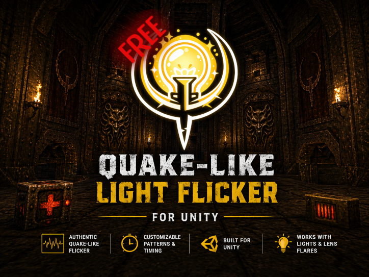

# Quake-Like Light Flicker for Unity

A lightweight Unity component that reproduces Quake-like light flickering using classic string-based lightstyle patterns.

## Features
- Quake-style `"a–z"` intensity pattern system  
- Optional preset support for quick setup  
- Adjustable max intensity and step speed  
- Works with Light and LensFlare components  
- Simple, performant, no external dependencies  

## Usage
1. Attach the QuakeLikeLightFlicker component to a GameObject with a Light component (optional: Lens Flare)  
2. Optionally assign a preset or use a custom pattern string  
3. Tune Max Intensity and Step Interval to shape the effect  

## Notes
- Updates continuously during runtime  
- For large scenes, consider distance or visibility culling for optimization  

## References
- [Valve Developer Wiki – Lightstyle](https://developer.valvesoftware.com/wiki/Lightstyle)  
- [Quake Source Code (id Software on GitHub)](https://github.com/id-Software/Quake)
